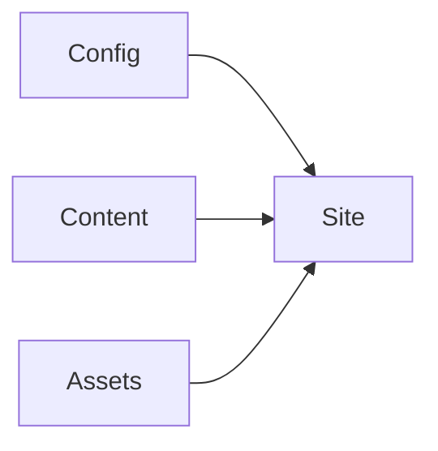

import exampleLight from './assets/example.svg';
import exampleDark from './assets/example-dark.svg';

This starter is a folder-per-article blog. Each folder has one entrypoint, `index.md` or `index.mdx`, plus any files that belong only to that article. Astro turns the entrypoint into `/blog/<folder-name>/`; the folder name is the URL slug.

## Article folder at a glance

```text
src/content/blog/kitchen-sink/
├── index.mdx              # required article entrypoint and frontmatter
├── left-aside.mdx         # optional content for the left rail
├── right-aside.mdx        # optional content for the right rail
└── assets/                # optional, local media for this article
    ├── hero.webp          # optional visible article hero (at most one hero.*)
    ├── social.png         # optional social preview (at most one social.*)
    ├── example.svg        # ordinary article image
    ├── example-dark.svg   # dark-theme variant of the example
    └── screenshot.png     # more local media, if needed
```

Use exactly one entrypoint: `index.md` or `index.mdx`. The sidecars and each image are optional; this example includes both sidecars and a social image, but no hero.

This example stays in the repository as a learning fixture. Its `draft: true` frontmatter keeps it visible during development while excluding it from production pages, RSS, and the sitemap. Remove or set that field to `false` when an article is ready to publish.

## Article metadata

The frontmatter describes the article: `title` and `description` feed the page and social metadata, `pubDate` controls its archive date and ordering, `updatedDate` is optional, and `tags` appear in the archive and article rail. These are editorial values; the site's name, URL, language, navigation, and external links live in `src/site.config.ts`.

## Markdown and local assets

Images belong in the article's `assets/` folder and can be referenced with a relative path. This example has a light and dark variant stored beside the post.

<figure class="theme-image-pair">
  
  
  <figcaption>The visible variant follows the site's current light or dark theme.</figcaption>
</figure>

For a theme-specific pair, include both images in the article and mark them with `image-light` and `image-dark` inside a `theme-image-pair` wrapper. The site crossfades between them over the same duration as the theme colors. Ordinary images need no special classes.

The conventional `assets/hero.*` file, when present, is shown above the article body. `assets/social.*` supplies the social preview image. If there is no explicit social image, the blog falls back to the hero, then the first remaining supported image in `assets/` by name, then the site's default social image. This post uses `assets/social.png` for its social preview and has no hero.

## Optional sidebars

The files `left-aside.mdx` and `right-aside.mdx` beside this entrypoint populate the article's left and right rails. Both are optional and discovered by filename, so there is no frontmatter setting to connect them. The right rail also contains tags and the table of contents. `hello-world` demonstrates an article without either sidecar.

## Code and syntax highlighting

```ts
type Post = {
  title: string;
  published: boolean;
};

const post: Post = { title: 'Kitchen sink', published: true };
```

## Math

Inline math works: $e^{i\pi} + 1 = 0$.

$$
\int_0^1 x^2\,dx = \frac{1}{3}
$$

## Mermaid



## MDX

<details>
  <summary>This native disclosure works without a client framework</summary>
  <p>MDX lets you use semantic HTML where plain Markdown is not enough.</p>
</details>

The blog also provides an archive grouped by publication date, responsive article layout, keyboard navigation, light and dark themes, RSS, canonical URLs, and sitemap metadata. The table of contents is generated from this post's headings.
